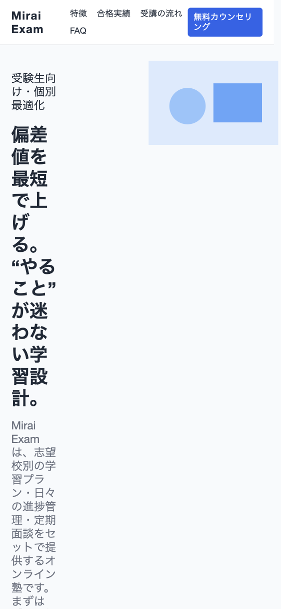
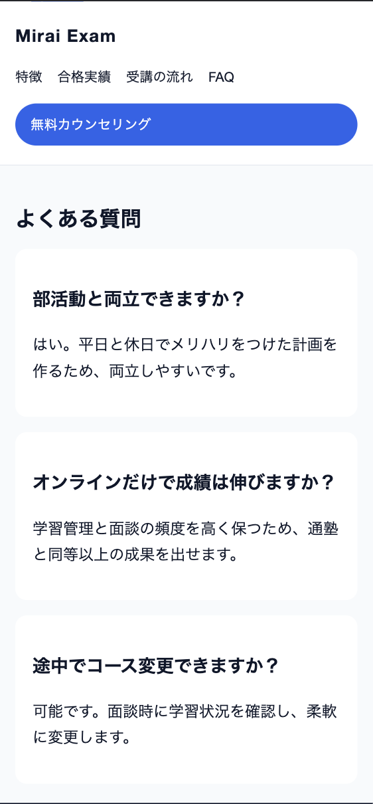
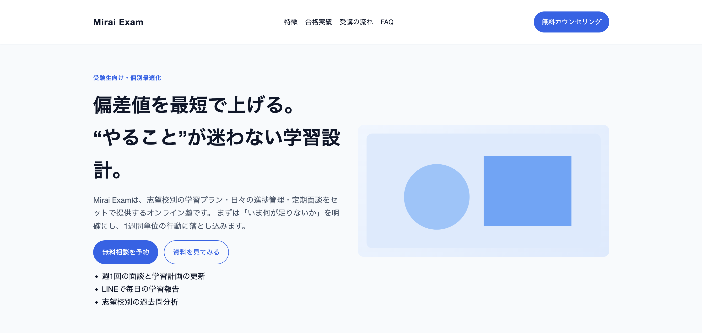
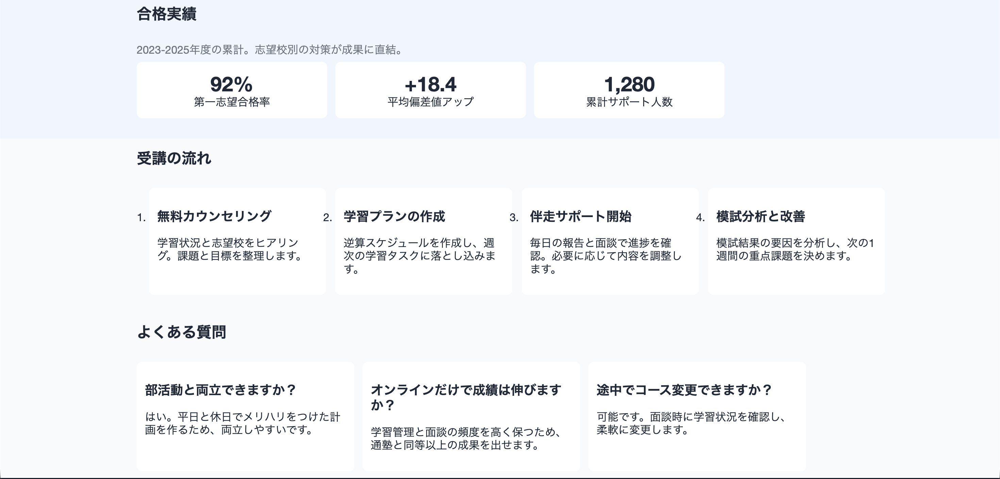
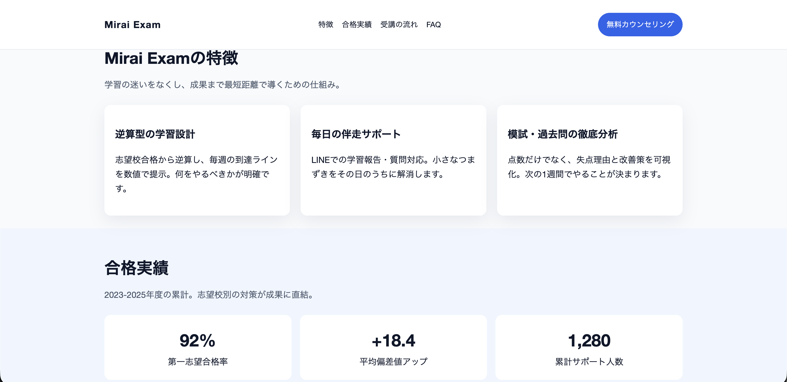
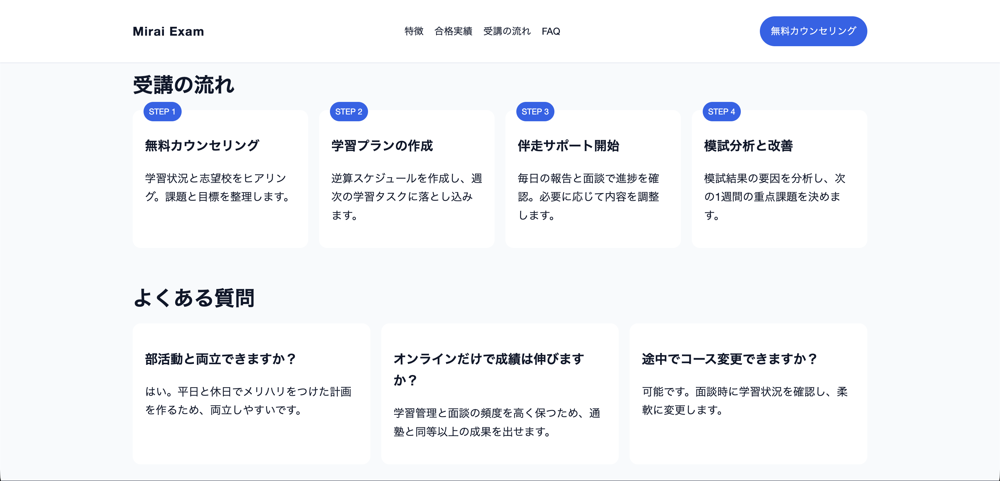

# ポートフォリオ素材：既存ページのHTML/CSS修正（SP崩れ修正）

受験生向けLPの「Before/After」を比較できる静的サイトです。
`?style=before` と `?style=after` でCSSを切り替えます。

---

## デモ
- Before（崩れあり）: https://aoiishikawa1818.github.io/responsive-fix-sample/?style=before
- After（修正後）: https://aoiishikawa1818.github.io/responsive-fix-sample/?style=after

## 変更したファイル
- `index.html` / `before.css` / `after.css`（SP崩れ修正・余白/タイポ調整）

## 確認環境
- Chrome / iPhone表示（DevTools）で確認

## 作業の進め方
- 修正指示 → 反映 → Before/Afterスクショで差分共有 → 必要なら微調整
- 影響範囲が大きい変更は、事前に相談してから対応

---

## 使い方

### 1) ローカルで開く（最短）
- `index.html` をブラウザで開く
- URLの末尾に `?style=before` または `?style=after` を付ける
  - 例: `index.html?style=before`

### 2) 簡易サーバで開く（推奨）
- Pythonがある場合
  - `python3 -m http.server 8080`
  - ブラウザで `http://localhost:8080/index.html?style=before`

---

## Before/Afterで直した点

### Beforeの問題点
- [x] 3カラム/4カラムが横にはみ出してスクロールが発生
- [x] ナビが折り返しで崩れ、CTAと被る
- [x] ボタンのタップ領域が小さく押しにくい
- [x] 見出しの余白がバラバラで読みづらい
- [x] 画像の縦横比が歪む

### Afterでの修正
- [x] メディアクエリで1カラム化し横スクロールを解消
- [x] ナビの配置と折り返しを調整
- [x] ボタンの最小高さを44pxにしてタップ領域を確保
- [x] 見出し/本文の余白と行間を統一
- [x] 画像は `object-fit: cover` で比率維持

---

## SP（スマホ表示）修正スクショ

### Before（SP）- ヘッダー：ナビが2段に折り返し／CTA文言が途中改行、ヒーロー見出しも縦割れで読みにくい

### After（SP）- ヘッダー：ナビ1行＋CTAを独立配置、ヒーロー見出しの改行を自然にして可読性UP

### Before（SP）- 特徴/実績/受講の流れ/FAQ：複数カラムのままで横幅不足（カードが詰まる・一部見切れ）

### After（SP）- 特徴：カードを1カラム化して読みやすく（余白・行間も調整）

### After（SP）- 合格実績：数値カードを縦積みで視認性UP（横スクロールなし）

### After（SP）- 受講の流れ：STEPカードを縦並びにして見切れ解消（タップもしやすい）

### After（SP）- FAQ：カードを1カラム化して文章が読みやすい

---

## PC（デスクトップ表示）修正スクショ

### Before（PC）- ヒーロー：CTAボタンが小さめで目立ちにくい／ファーストビューの情報量が多く、視線誘導が弱い

### After（PC）- ヒーロー：CTAを大きくして強調／見出し・本文・画像のレイアウトを整理して読みやすく

### Before（PC）- 合格実績/受講の流れ/FAQ：カードは並ぶが、見出し・STEP表示の統一感が弱く、情報のまとまりが出にくい

### After（PC）- 特徴/合格実績：セクション見出しを強調／カードの余白とサイズ感を統一して見やすく

### After（PC）- 受講の流れ/FAQ：STEPラベルを統一し、カードの情報のまとまりを改善（読み順が分かりやすい）

